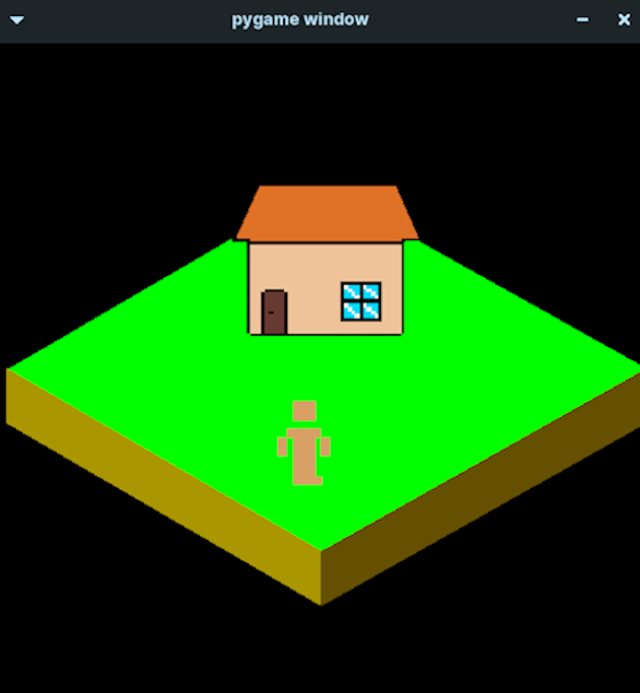

# PROJETO DE ESTUDO - PYGAME ISOMÉTRICO
## Sobre
 Este repositório tem como objetivo em estudar os jogos isométricos utilizando a biblioteca Pygame da linguagem.

 


## Tecnologia Utilizadas
- Python v3.8.10
- Pygame v2.5.2
- cx_Freeze v6.15

## Desenvolvimento
Para construir este programa em seu PC, utilize em seu terminal este comando git:
```bash
git clone https://github.com/DarkCells/Game_pygame.git
```
Por fim, acesse ele e faça os seus estudos. Crie um fork ou faça um pull com as devidas mensagens de melhoria ou contribuição.


## Contatos
- Instagram: @tec_marciomoda ou @darkcells.official
- email: marciomoda18@gmail.com
- LinkedIn: márcio-moda

## LICENÇA
GNU GENERAL PUBLIC LICENSE,                        Version 3, 29 June 2007.